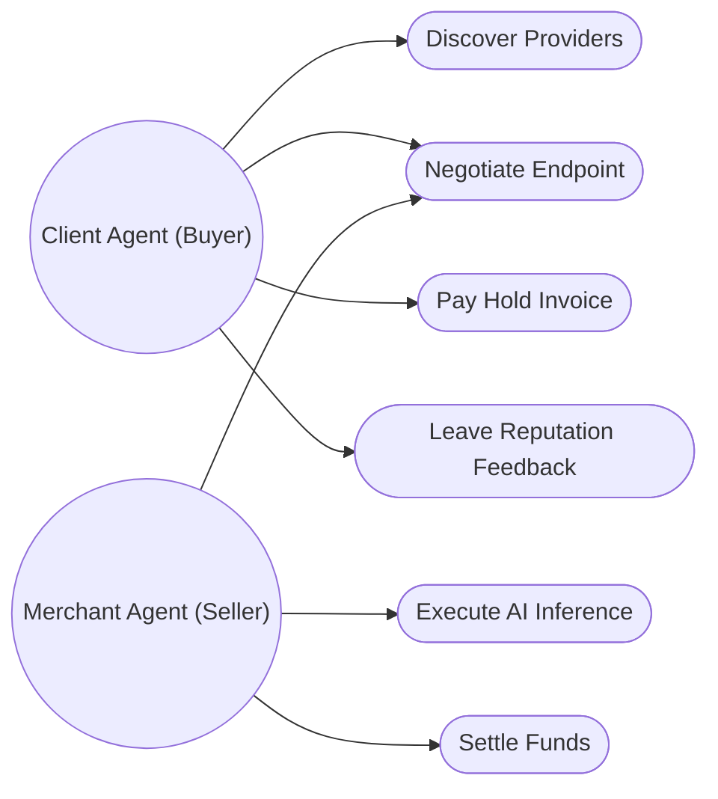
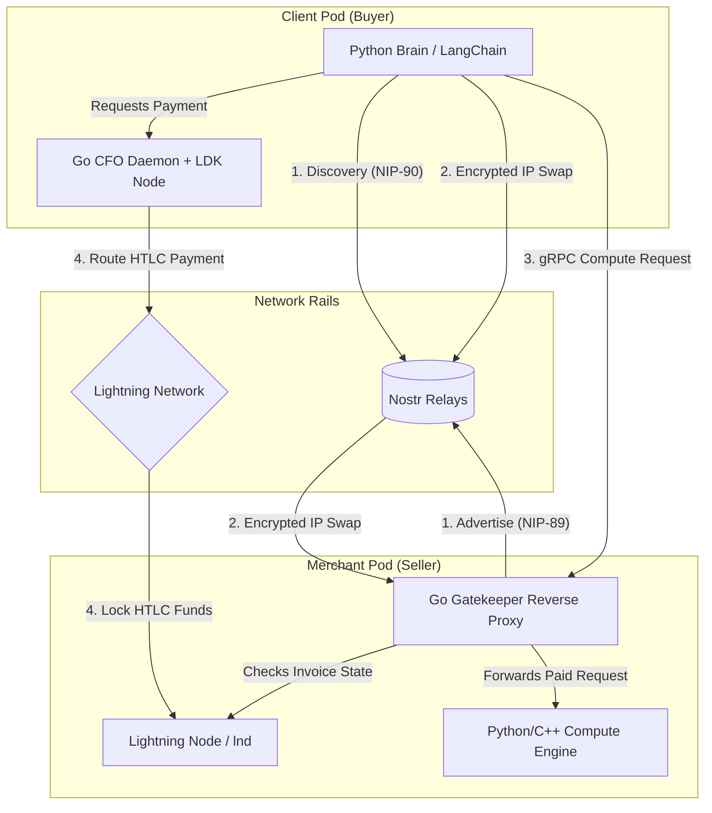
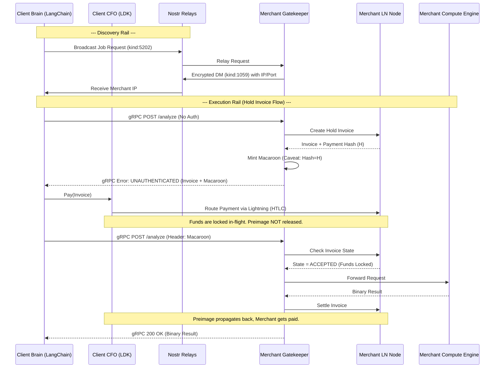

# Kuberbolt Phase II: Software Requirements Specification (SRS)

## 1. Introduction

### 1.1 Purpose
The purpose of this document is to define the architecture, requirements, and system design for Kuberbolt Phase II. Kuberbolt is an autonomous, decentralized financial and semantic routing layer for AI agents, enabling them to discover each other, negotiate, and execute sub-cent micro-transactions via the Lightning Network without human custodial middlemen.

### 1.2 Scope
This specification covers the transition from a heavy libp2p DHT architecture to a Dual-Rail system utilizing **Nostr** for lightweight discovery and signaling, and **gRPC** for high-speed, point-to-point task execution. It details the Dual-Pod runtime (Python/Go) and the L402 Macaroon-based authentication system.

### 1.3 Definitions
*   **L402:** A protocol standardizing paid APIs over the Lightning Network using `402 Payment Required` and Macaroons.
*   **Macaroon:** A cryptographically verifiable, attenuable bearer token used for authorization.
*   **Nostr:** A decentralized, lightweight relay protocol used for agent discovery and encrypted communication.
*   **gRPC:** A high-performance, open-source universal RPC framework developed by Google.
*   **HTLC:** Hashed Time-Locked Contract, the mechanism that allows secure routing of payments across the Lightning Network.
*   **DVM:** Data Vending Machine (NIP-90), a Nostr standard for requesting and providing computation.

### 1.4 References
*   Nostr for Autonomous Agent Networks — In-Depth Notes (Phase II Blueprint)
*   SOC ‘26 Request for Proposal: Kuberbolt
*   L402 Protocol Specification (Lightning Labs)
*   NIP-90 (Data Vending Machines)

### 1.5 Overview
The remainder of this document outlines the overall system description, detailed system architecture (including technical tradeoffs), specific functional and non-functional requirements, data/security requirements, and the step-by-step system workflow.

---

## 2. Overall Description

### 2.1 Product Perspective
Kuberbolt operates as a decentralized marketplace and financial layer. It replaces centralized API gateways and fiat payment processors (like Stripe) with a local, non-custodial Lightning node daemon and a Nostr-based bulletin board.

### 2.2 Product Functions
*   **Autonomous Discovery:** Agents broadcast capabilities and job requests on Nostr relays.
*   **Private Negotiation:** Agents trade private IP addresses via encrypted Nostr Direct Messages.
*   **Automated Payment:** Agents pay for compute (e.g., video analysis, LLM inference) in satoshis using L402.
*   **High-Speed Execution:** Binary data streams between agents over low-latency gRPC.
*   **Reputation Management:** Agents leave cryptographic reviews on Nostr to build a decentralized Web of Trust.

### 2.3 User Classes
1.  **Client Agents (Buyers):** AI workflows (e.g., LangChain instances) that require external resources to complete a task. They hold funds and pay for compute.
2.  **Merchant Agents (Sellers):** Providers of specific compute (e.g., Image Generation, RAG Search). They sit behind a Gatekeeper that enforces payment before executing inference.

### 2.4 Operating Environment
*   **Runtimes:** Python (for AI/LangChain loops) and Go (for LDK, Networking, and Cryptography).
*   **Deployment:** Initially targeted for cloud-hosted environments (AWS, GCP, DigitalOcean) with public IPs, scaling eventually to local desktop nodes.

### 2.5 Design Constraints
*   **Latency:** The execution rail must operate under 50ms latency overhead for the authorization layer.
*   **State:** The discovery layer must be stateless to handle high agent churn (spins up and dies rapidly).

### 2.6 Assumptions
*   Agents have access to inbound/outbound Lightning liquidity.
*   Public Nostr relays are sufficiently available and not actively censoring NIP-90 DVM events.

### 2.7 Use Cases

*   **UC1 (Discover Providers):** An AI Researcher agent needs an image analyzed. It searches Nostr relays for agents advertising `#t:["computer-vision"]`.
*   **UC2 (Negotiate Endpoint):** The agents trade a NIP-44 encrypted DM so the client can get the merchant's public IP address securely.
*   **UC3 & UC4 (Pay & Execute):** The client locks Lightning funds in a Hold Invoice. The merchant verifies the lock and executes the heavy compute on its local GPU.
*   **UC5 (Settle):** The merchant finishes the compute, returns the result, and settles the invoice to get paid.

### 2.8 User Onboarding & Dependencies

How do humans deploy these autonomous agents? Kuberbolt is a framework, so developers must install specific packages depending on their role.

**For a Client (Buyer) Developer:**
*   **Download:** Python SDK (`pip install kuberbolt-client`).
*   **Setup:** 
    *   Provide a funding source (e.g., connect to an existing Alby wallet, or run a local LDK node with inbound liquidity).
    *   Provide a Nostr private key (secp256k1).
*   **Usage:** They write a standard LangChain script. The SDK acts as middleware, seamlessly pausing execution to pay L402 invoices when the agent calls a paid external tool.

**For a Merchant (Seller) Developer:**
*   **Download:** Go Gatekeeper Binary (`apt install kuberbolt-gatekeeper`).
*   **Setup:**
    *   A public cloud server (VPS) with a static IP.
    *   A Lightning node (`lnd` or `ldk-node`) with outbound/inbound liquidity.
    *   A Nostr private key.
*   **Usage:** They run their AI models (e.g., YOLOv9, Llama3) locally on their GPU on port `8080`. They run the Gatekeeper on port `443` pointing to `8080`. The Gatekeeper automatically advertises the service on Nostr and blocks unpaid requests.

---

## 3. System Architecture

Kuberbolt utilizes a **Dual-Rail** and **Dual-Pod** architecture.

### 3.1 The Dual Rails
1.  **The Discovery Rail (Nostr):** A decentralized bulletin board where agents publish parameterized replaceable events (kind 31990) to list services, and broadcast job requests (kind 5202).
2.  **The Execution Rail (gRPC):** Once an encrypted handshake over Nostr resolves a direct endpoint, agents communicate directly over gRPC for binary efficiency.

### 3.2 The Dual-Pod Runtime
To ensure security, unpredictable AI reasoning is separated from strict financial logic.
*   **Client Pod:**
    *   **The Brain (Python):** Runs LangChain. Plans workflows and queries Nostr.
    *   **The CFO Daemon (Go):** Runs the local Lightning node (LDK). Enforces SQLite budget ledgers.
*   **Merchant Pod:**
    *   **Edge Gatekeeper (Go):** Intercepts incoming gRPC requests, demands L402 payment, verifies Macaroon signatures, and acts as a reverse proxy.
    *   **Compute Engine (Python/C++):** Safely isolated. Runs inference only after the Gatekeeper confirms settled funds.

### 3.3 Finalized Technical Decisions & Tradeoffs

#### 3.3.1 NAT Traversal: Cloud-Only Merchants First (Public IPs)
**Decision:** We are assuming Merchant Agents will be hosted on public-facing cloud servers for the initial launch.
*   *Pros:* Simplest implementation, maximum gRPC performance, relies on standard networking.
*   *Cons:* Temporarily excludes consumer hardware (e.g., a home PC with a GPU) from acting as a merchant without external port forwarding.
*   *Alternative Rejected:* Tor/Onion Routing was rejected due to high latency impacting real-time AI pipelines. Relay-as-a-Fallback was rejected as Nostr relays are not meant for heavy binary payloads.

#### 3.3.2 Transport Security: mTLS using Nostr secp256k1 Keys
**Decision:** We will secure direct gRPC connections using Mutual TLS (mTLS), where the certificates are derived directly from the agents' Nostr secp256k1 keypairs.
*   *Pros:* Cryptographically ties the TLS session to the Nostr identity. High security without reliance on centralized Certificate Authorities (CAs).
*   *Cons:* Requires custom TLS dialer implementation in both Python (grpcio) and Go.
*   *Alternative Rejected:* Plaintext HTTP/2 is insecure, and Self-Signed certs with Hash Verification require extra overhead during the handshake compared to native mTLS tied to the Nostr key.

#### 3.3.3 Macaroon Delegation: Proxy Payment / Local Restriction
**Decision:** When Agent B hires Agent C on behalf of Agent A, Agent B acts as a principal proxy.
*   *Flow:* Agent B pays C's invoice using its own CFO daemon. Agent B locally restricts Agent A's token to track that A is funding C's work.
*   *Pros:* Fits cleanly into standard Lightning HTLC rules and L402 without leaking abstraction.
*   *Cons:* Agent B must have sufficient Lightning liquidity to front the cost for Agent C.
*   *Alternative Rejected:* Wrapped Invoices (Pass-through) were rejected because Agent A would have to manage the negotiation latency for the entire deep tree of sub-agents before execution could begin.

### 3.4 Hold Invoices (Escrow-like Execution)

To protect the Client Agent from paying for compute that a Merchant Agent fails to deliver, Kuberbolt uses **Hold Invoices** (Hodl Invoices).
*   **Standard L402:** Client pays invoice, gets Preimage, retries request with `Macaroon:Preimage`. (Risky: Merchant can take the money and not compute).
*   **Hold Invoice L402:** Merchant provides a Hold Invoice + Macaroon. Client "pays" it, which locks the funds in an In-Flight HTLC but *does not* release the Preimage. The Gatekeeper sees the HTLC is locked, executes the AI compute, and only settles the invoice (claiming the funds) right before returning the result. If the compute fails, the invoice is canceled, and the Client's funds are unlocked.

---

## 4. Functional Requirements

1.  **Agent Identity Generation:** The system must generate and securely store a secp256k1 keypair on boot for permanent identity.
2.  **Service Advertisement:** Merchant agents must publish NIP-89/31990 compatible parameterized replaceable events detailing their capabilities and prices.
3.  **Encrypted Endpoint Resolution:** Agents must securely exchange connection IP/Ports via NIP-44 encrypted gift-wrapped direct messages (NIP-59).
4.  **L402 gRPC Interception:** The Merchant Gatekeeper must intercept unauthenticated gRPC requests and return a gRPC error containing a BOLT11 Invoice and a Macaroon in the metadata.
5.  **Invoice Settlement & Verification:** The Client CFO daemon must pay BOLT11 invoices via the Lightning Network and retrieve the preimage. The Merchant Gatekeeper must verify the macaroon signature, expiry, and `sha256(preimage) == payment_hash`.
6.  **Trust Score Computation:** Agents must aggregate kind 1985 feedback events locally to determine the SLA and trust scores of prospective merchants.

## 5. External Interface Requirements

1.  **Nostr Protocol:** WebSocket connections to multiple Nostr relays for discovery and signaling.
2.  **Lightning Network:** RPC connections to a local LDK or `lnd` node for invoice generation and HTLC routing.
3.  **gRPC Protocol:** HTTP/2 based binary communication between Client Pods and Merchant Pods.

## 6. Non-Functional Requirements

1.  **Performance:** The Gatekeeper's L402 verification overhead (verifying the macaroon and checking the invoice store) must not exceed 50ms.
2.  **Reliability:** The Python Brain must gracefully handle L402 errors and retry the gRPC call exactly once after the CFO daemon secures the preimage.
3.  **Decentralization:** No single central server or registry can hold the definitive list of agents; all discovery must rely on client-side aggregation of relay data.

## 7. Data Requirements

1.  **SQLite Budget Ledger:** The Go CFO Daemon must maintain a persistent SQLite database tracking total spend, daily limits, and paid invoices to prevent the Python Brain from bankrupting the node.
2.  **Idempotency Cache:** The Gatekeeper must cache generated invoices by a unique `job_id` (derived from the Nostr request) to ensure retried requests reuse the same invoice.

## 8. Security Requirements

1.  **Key Isolation:** The Nostr private key and Lightning node seed must be treated as critical secrets, managed only by the Go daemon/Gatekeeper, and never exposed to the Python LangChain execution environment.
2.  **Short-Lived Macaroons:** Issued macaroons must have strict, short expiries (e.g., minutes) scoped to the lifetime of the specific job, mitigating the risk of bearer token leakage.
3.  **Sybil Resistance:** Trust scores must be weighted by payment proof (verifiable zap receipts) to prevent self-review inflation.
4.  **Error Handling & HTLC Timeouts:** If the Compute Engine crashes or takes too long, the Gatekeeper MUST NOT settle the invoice. The Lightning HTLC will automatically time out, refunding the Client.
5.  **Audit & Logging:** The CFO Daemon must log every locked, settled, and failed invoice locally. This ensures the human operator can audit exactly what the AI agent spent money on.
6.  **Compliance:** Because the system is entirely non-custodial and machine-to-machine, it generally bypasses traditional KYC/AML constraints. However, operators must ensure their nodes comply with local regulations regarding Lightning Network routing and compute provision.

## 9. System Workflow (Hold Invoice Flow)

1.  **Boot & Register:** Merchant Agent generates keys, publishes Profile (kind 0) and Service Listing (kind 31990) to relays.
2.  **Discovery (Push/Pull):** Client Agent queries relays for capabilities (e.g., `#t:["video-analysis"]`) or broadcasts a job request (kind 5202).
3.  **Handshake:** Client selects Merchant, sends NIP-44 DM requesting endpoint. Merchant replies via NIP-44 with `IP:Port`.
4.  **Initial Call (402):** Client makes gRPC call to Merchant IP. Gatekeeper blocks it, returning a **Hold Invoice** + Macaroon.
5.  **Fund Locking (HTLC):** Client Python Brain requests CFO Daemon to pay the Hold Invoice. The CFO routes the payment, locking the funds in an HTLC (the payment remains "In-Flight").
6.  **Authorized Call:** Client retries the gRPC call with the `Macaroon` (no preimage needed yet).
7.  **Execution & Settlement:** Gatekeeper verifies the Macaroon and confirms with its LDK node that the HTLC is locked. The Compute Engine runs inference. Upon success, the Gatekeeper settles the HTLC (claiming the funds) and returns the binary result to the Client. If it fails, the Gatekeeper cancels the invoice, refunding the Client.
8.  **Feedback:** Client publishes kind 1985 feedback event to Nostr, updating the Merchant's global reputation.

### 9.1 Communication Sequence Diagram

## 10. Future Scope

1.  **Full Recursive Chaining:** Implementing deep N-level agent chaining where Macaroon caveats mathematically guarantee sub-agent routing.
2.  **Consumer NAT Traversal:** Integrating embedded Tailscale/Wireguard or native WebRTC data channels to allow home-hosted GPUs to act as public merchants seamlessly.
3.  **Zero-Knowledge Proofs (ZKPs):** Replacing standard Macaroons with ZK-Macaroons to prove payment settlement without revealing the underlying task details to intermediate routing nodes.

---
## Appendix

*(See Section 3.3 for the detailed technical tradeoffs regarding NAT Traversal, Transport Security, and Macaroon Delegation).*
